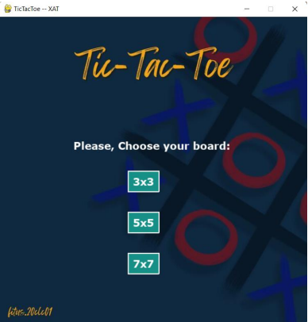
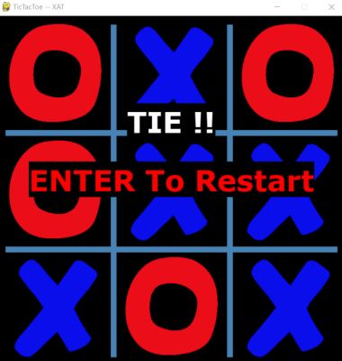

# Tic Toe Te
- The adversarial searching algorithm
- Implement an application (tic-tac-toe problem) and apply the 
adversarial technique to solve that tic-tac-toe

## Problem
- Programming language: Python
- Implement a tic-tac-toe game (Vietnamese: trò chơi caro). For simplicity, students just need to implement 3x3, 5x5 and 7x7 maps.
- Player 1, Computer will control player 2.
- Choose any adversarial search. Using that adversarial search to find the optimal path, which will help the computer to win this game.

## Imgae

